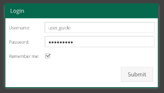
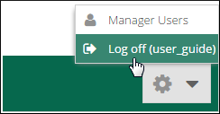
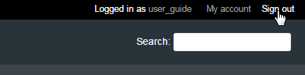
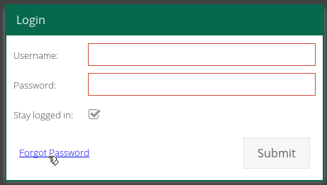
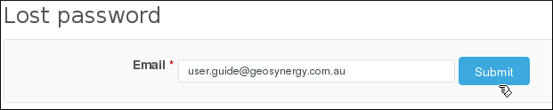
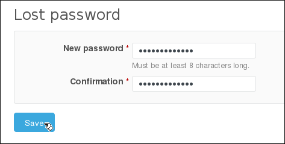
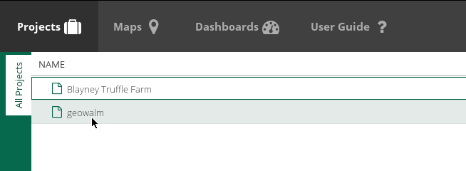
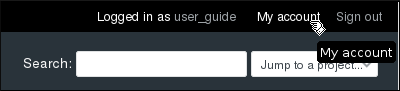
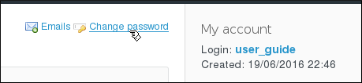
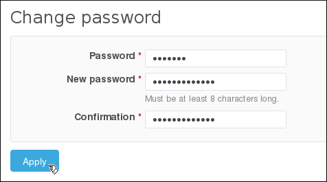

Entering the Truffala Plataform
===============================

Here you'll see how to acess the Truffala Plataform.

Log in / Log out
^^^^^^^^^^^^^^^^

|bullet| **Log in**

Acess the site where Truffala Plataform is located and insert your *Username* and *Password*. As the follow picture:

.. tip::
        You can check **Remember me** to save you login information.

After click on **Submit** you will be redirect to the `Landing Page <http://www.google.com>`_. In case you lost your password, see `Forgot Password <forgot_password_>`_ section and learn how to retrieve it.

|bullet| **Log out**

If you are at the `Landing Page <http://www.google.com>`_, click on the *Engine* and after on **Log off**, like this:

Also, if you are currently at Redmine Interface you can Log out by clicking on **Sign out**:

.. _forgot_password:

Forgot Password
^^^^^^^^^^^^^^^

In case you have *forgotten your password*, you'll need to click on **Forgot Password** on the login area, as the follow image:

You'll be redirect to a page on *Redmine* to insert your e-mail to **retrieve your password**.

On your mailbox will be delivery an e-mail with instructions for change your password. The link on the e-mail open a page where you'll need to insert the **New password** and a **Confirmation** of it.

If it has no errors, after click on *Save* you'll be able to **login on Truffala** with your new password.

Change Password
^^^^^^^^^^^^^^^

For change the password we need go to the `Redmine Interface of Truffala <http://www.google.com.br>`_. To achieve it, inside the `Project <http://www.google.com>`_ button on the Landing Page click on a random project.

You can check that the Redmine frame for the project you clicked will be displayed. 

.. note::

	This **Redmine frame** have all the needs areas for *your daily use of Redmine*, but for some **administrative settings and tasks** you'll need open the Redmine on a new tab to make them. This is the case of **change password**.
	
	See the `Redmine Interface of Truffala <http://www.google.com.br>`_ for more information.
	

To open the Redmine on a new tab, right click on a random link on the Redmine frame and choose *Open Link in New Tab*. As the follow picture:

.. image:: ../static/opennewtab.png
	:align: center

Inside Redmine, click on **My account** on the top right of the screen.

After, click on **Change password**, as the follow picture:

On this screen, you'll need to insert your **currently password**, your **new password** and the **confirmation**.

If it has no error, after you click apply you receive a message that the **Password was successfully update** and it will be your new password for use in Truffala.

.. warning::
        **TODO:**

        * Insert link on the Landing Page L22
        * Insert link on Project L44
	* Insert link for Redmine Interface o Truffala
	* Explain about the administrative setting and tasks on Redmine Interface of Truffala

