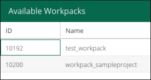
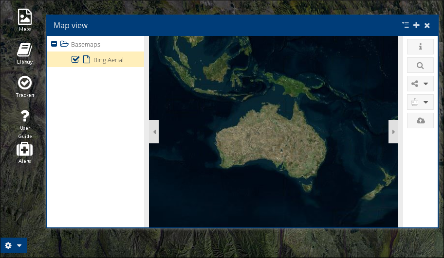
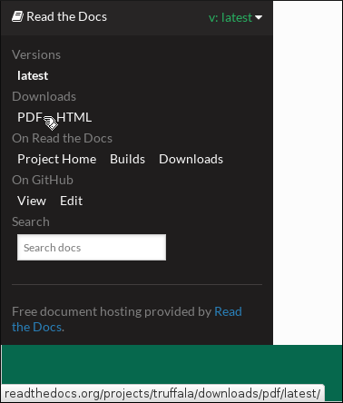

Landing Page
============

The *Landing Page* is a interface that was built to facilitate the daily use of Truffala Plataform.

.. note::

	It's designed to become like a game console interface, **enabling the user to do quick tasks and easily get informations and reports**.

Basicaly, on *Landing Page*, you'll work with this four buttons:

.. image:: ../static/landingpage_buttons.png
	:align: center

Projects
********

When you click on *Projects* you area able to see the **Projects Tree** screen.
This interface will help you managing the projects by provinding a easy interface to acess them.

For example, if we create a project called *Sample Project*, that is how it will be shown:

.. image:: ../static/project.png
	:align: center

.. hint::

	If you don't have a project created, check `How create your first project <www.google.com>`_ on Truffala.

If you *left click* on the project name, it will open a frame showing the Redmine screen of the currently project. Check the `Redmine Interface of Truffala <www.google.com>`_ to get more information.

As you'll creating *subprojects*, they are going to be showing as folders here. **It has the function of facilitating your navigation and managing of the projects**. For example:

.. image:: ../static/project_subproject.png
	:align: center

.. important::
	
	After create a *subproject*, you'll need to **reload the page** for the new subprojects appears on the *Projects Tree*.

Maps
****

Inside *Maps* you can list and view all the **Available Workpacks** for all your projects.

.. note::
	
	**Workpack** is ... TODO

They will be organized by two columns (**ID** and **Name**), as the follow picture:

.. important::

        Every *workpack* you'll create must be referenced by a **Redmine Project**.

You can click on the *workpack* you want to acess and it will load on your screen with all tools enabled by the **project administrator**. Check the next example showing a workpack:

The **Maps** button on *Landing Page* is **where you'll going to create workpacks**. If you don't have a workpack created, check `How create your first workpack <www.google.com.br>`_ for more details.

.. important::
	Check the `Mapping section <www.google.com.br>`_ to see and understand **what you can do with your workpack** and how to configure it for your project.

With the **workpacks** you'll be able to upload geospatial data, automate process and alerts and integrate the geospatial information with the project management. 

.. note::

	You'll be able to use a `geospatial intelligence <www.google.com.br>`_ plataform (*Truffala*) **in favor of your project**. 

Dashboard
*********

The *Dashboard* will help you by summarise all the relevant information contained within the Redmine. **It provide management summaries**, like: activity, amounts of things, charts, stuff, reports.

``Waiting #40883 <https://synmine.kegsys.com/issues/40883> .``

User Guide
********** 

The *User Guide* button will redirect you for this material that you'are currently reading. 
This guide **is intended to be a quick but comprehensive guide to the plataform** and show how it can help your daily work.

If you want to, you are able to download this guide in **PDF** with the *lastest* version of Truffala. Do as the follow picture:

.. hint:: 

	You can use the *search box* to **find what you are looking for faster**. For example: 

	.. image:: ../static/searchbox.png
		:align: center
.. warning::
	TODO

	* Create a **How to create your first project**
	* Link the Redmine Interface of Truffala
	* Complete **Dashboard**
	* Do the workpack definition
	* Make a list for the SRID
	* Check how the **workspace** will be handle.
	* Create a **How to create a workpack**
	* Create the **Mapping section**
	* Geospatial intelligence link 62
