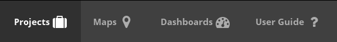
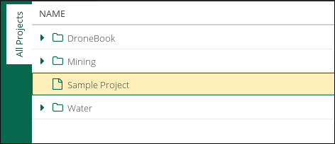
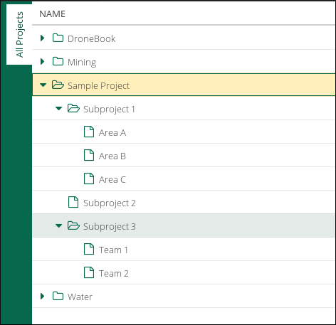

Landing Page
============

The *Landing Page* is a interface that was built to facilitate the daily use of Truffala Plataform.

.. note::

	It's designed to become like a game console interface, **enabling the user to do quick tasks and easily get informations and reports**.

Basicaly, on *Landing Page*, you'll work with this four buttons:

Projects
********

When you click on *Projects* you area able to see the **Projects Tree** screen.
This interface will help you managing the projects by provinding a easy interface to acess them.

For example, if we create a project called *Sample Project*, that is how it will be shown:

.. hint::

	If you don't have a project created, check `How create your first project <www.google.com>`_ on Truffala.

If you *left click* on the project name, it will open a frame showing the Redmine screen of the currently project. Check the `Redmine Interface of Truffala <www.google.com>`_ to get more information.

As you'll creating *subprojects*, they are going to be showing as folders here. **It has the function of facilitating your navigation and managing of the projects**. For example:

.. important::
	
	After create a *subproject*, you'll need to **reload the page** for the new subprojects appears on the *Projects Tree*.

- - - - - 

.. warning::
	TODO

	* Create a **How to create your first project**
	* Link the Redmine Interface of Truffala
